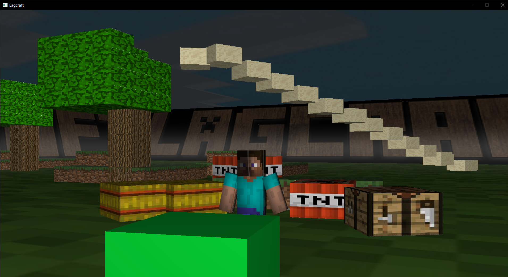

# Lagcraft

Un minecraft low-cost mais open-source ;).

## Introduction

> **Perdu dans le multiverse**
> Vous êtes Steve, le personnage emblématique du jeu minecraft :heart_eyes:. Pour d'obscures raisons, vous êtes propulsé au travers du multivers dans un nouveau monde, le monde de ***Lagcraft***. Vous y êtes malheureusement **coincé à tout jamais** :cold_sweat:... À vous de vous y faire une raison et de reprendre le cours de votre vie, ici, à Lagcraft.

*L'objectif de ce projet était l'initiation à opengl au travers de python.*

## Les fonctionnalitées

Dans Lagcraft, vous pouvez construire et détruire des blocs à l'infinie. Laissez parler votre créativité ! Un mix (*pas ouf*) entre ***Minecraft*** et ***Rust***.

#### Les touches

- **Z,D,Q,S** pour se déplacer.
- **Espace** pour sauter.
- **T** pour activer le monde de construction.
- **➝** et **🠔** pour changer le type de bloc.
- **R** pour activer le mode de destruction.
- **Click gauche souris** pour detruire ou poser un bloc.

### Fonctionnalitées disponible en V1

#### Les fonctionnalitées

Voici une liste des fonctionnalités que nous avons eu le temps de mettre en place dans la première version.

Fonctionnalité en v1 | Check
---------|----------
 Collision | :white_check_mark:
 Poser des blocs | :white_check_mark:
 Gravité | :white_check_mark:
 Saut | :white_check_mark:
 Gravité avec acceleration | :white_check_mark:
 Ciel | :white_check_mark:
 Generation de relief aléatoire | :white_check_mark:
 Generation d'arbre aléatoire | :white_check_mark:
 Retirer des blocs | :white_check_mark:
 Rendre le jeu plus esthétique | :construction:
 Generation de biome de different type | :x:
 Interaction avec certains blocs | :x:

#### Les blocs

Lagcraft propose tout un assortiment de bloc afin de réaliser vos constructions.

Blocs | Check
---------|----------
 Grass (terre/herbes) | :white_check_mark:
 Sand (sable) | :white_check_mark:
 TNT | :white_check_mark:
 Table de craft | :white_check_mark:
 Wood (Bois) | :white_check_mark:
 Paille | :white_check_mark:
 Lave/eau | :white_check_mark:

## Cahier des charges

> ### Réalisez un jeu 3D minimaliste de votre choix.
> Le sujet de votre jeu est libre mais doit contenir au moins deux programmes graphiques differents, des interactions utilisateurs et aussi la reutilisation intélligente d’objets (affichée plusieurs fois).
Idées de projets possibles: Voiture ou personnage se deplac¸ant sur un terrain discret, vaisseaux spatiaux, deplacement en vue à la première personne dans un monde 3D, labyrinthe,etc. Vous devrez ajouter differents effets tels que la possibilitée de tirer des projectiles, la gestion des collisions entre plusieurs objets, la gestion du temps et des animations, la gestion de
la camera ou l’interaction avec l’utilisateur au clavier ou à la souris (voir documentation des fonctions glfw).
> ##### Remarques: 
> On rappelle qu’une rotation s’applique toujours autour de l’origine, il est donc necessaire de translater l'objet si on souhaite faire tourner celui-ci autour d’un autre point tel que son centre par exemple
• Faites des choses simples dans un premier temps.
• Pretez une attention particulière aux déplacements de vos objets ainsi qu’au déplacement ´
possible de votre camera. Définissez vos repères et faites des schémas.
• Dans le cas de la gestion des collisions refl´ echissez comment détecter de manière approximative celles-ci.
> ##### Rendu:
> Rendez votre travail sous forme d’un commit sur github contenant:
• L’ensemble de vos fichiers sources.
• L’ensemble de vos donnees (textures, fichiers de maillages, etc). 
• Un rapport concis expliquant ce que vous avez realisée (5 à 10 pages max). Vous prendrez soin d’illustrer votre rapport avec des captures d’ecran de votre jeu associé aux explications des methodes que vous avez mis en place. Pour des approches géométriques, preférez des explications sous forme de schémas plutôt que de longs paragraphes.

## Auteurs

Eliot BADINGA, Rami MESSEOUDI, Livio SINGARIN-SOLE.