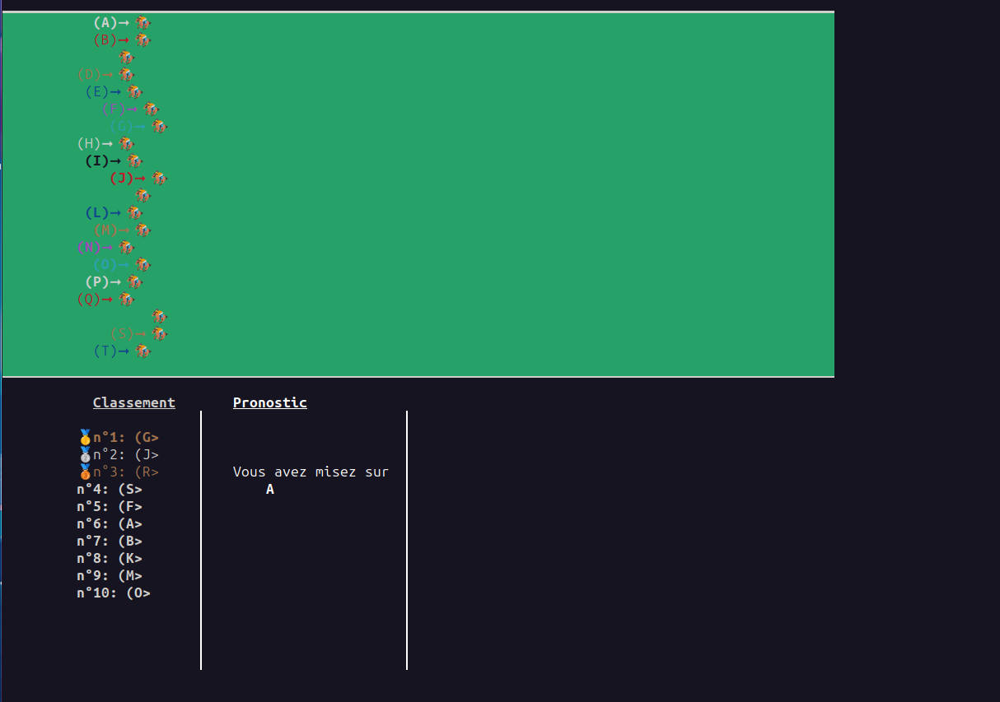

# Assortiment d'exercice CS-PC

## Introduction

## Sujet 2

### Simulation des déplacements d’un Robot

> Faire un robot qui se déplace sur une carte et qui tourne dès qu'il rencontre un obstacle. La partie graphique doit impérativement être réalisée sous TkInter.

#### Screenshot(s)

### Game of Life

> • The universe of the Game of Life is an infinite two-dimensional orthogonal grid of square cells,
each of which is in one of two possible states, alive or dead.
• Every cell interacts with its eight neighbours, which are the cells that are horizontally, vertically,
or diagonally adjacen

#### Screenshot(s)

## Sujet 1

### Course Hippique

> On souhaite réaliser, sur les machine Linux, une course hippique. 
Pour ne pas compliquer la "chose"", on n’aura pas recours aux outils d’affichages graphiques. Les affichages se feront en console avec des séquences de caractères d’échappement. Chaque cheval est représenté simplement par une lettre (ici de ’A’ à ’T’) que l’on a entouré ici par ’(’ et ’>’ : ce qui donne par exemple ’(A>’ pour le premier cheval (vous pouvez laisser libre cours à vos talents d’artiste). A chaque cheval est consacré une ligne de l’écran et la progression (aléatoire) de chaque cheval est affichée.

#### Fonctionnalités

Fonctionnalité | Check
---------|----------
 Ajout du processus arbitre | :white_check_mark:
 Ajout de chevaux plus réaliste | :white_check_mark:
 Affichage du classement en direct | :white_check_mark:
 Prise en charge des pronostics | :white_check_mark:
 Affichage bien segmenté | :white_check_mark:

#### Screenshot(s)

### Faites des calculs

> Problème traité sous forme simplifiée et triviale en cours : échange entre un client demandeur et
un serveur calculateur. Consulter les pdfs du cours.
On souhaite réaliser plusieurs calculs en parallèle demandés par un à plusieurs demandeurs.

#### Fonctionnalités

- version1.py: 1 demandeur, N calculateur, 1 queue
- version2.py: M demandeurs, N calculateurs, M queue de demande, M queue de réponse
- version2-2.py: M demandeurs, N calculateurs, 1 queue de demande, 1 queue de reponse
- version2-3.py: M demandeurs, N calculateurs, 1 queue de demande, 1 queue de reponse + **passages de fonction**

#### Screenshot(s)

### Gestionnaire de Billes

> On souhaite réaliser l’exemple suivant (lire à la fi de ce sujet à propos des variables de condition).
◦ N processus (p. ex. N = 4) ont besoin chacun d’un nombre k d’une ressource (p. ex. des
Billes) pour avancer leur travail
◦ Cette ressource existe en un nombre limité : on ne peut satisfaire la demande de tout le
monde en même temps.
Par exemple, la demande de P rocessi=1..4 est de (4, 3, 5, 2) billes et on ne dispose que de
nb_max_billes = 9 billes
◦ Chaque Processus répète la séquence (p. ex. m fois) :
"demander k ressources, utiliser ressources, rendre k ressources"
◦ Le "main" crée les 4 processus.
Il crée également un processus controleur qui vérifie en permanence si le nombre de Billes
disponible est dans l’intervalle [0..nb_max_billes]
◦ Pour chaque Pi
, l’accès à la ressource se fait par une fonction "demander(k)" qui doit bloquer
le demandeur tant que le nombre de billes disponible est inférieur à k
◦ Pi rend les k billes acquises après son travail et recommence sa séquence

#### Screenshot(s)

## Auteurs

Eliot BADINGA, Rami MESSEOUDI.
